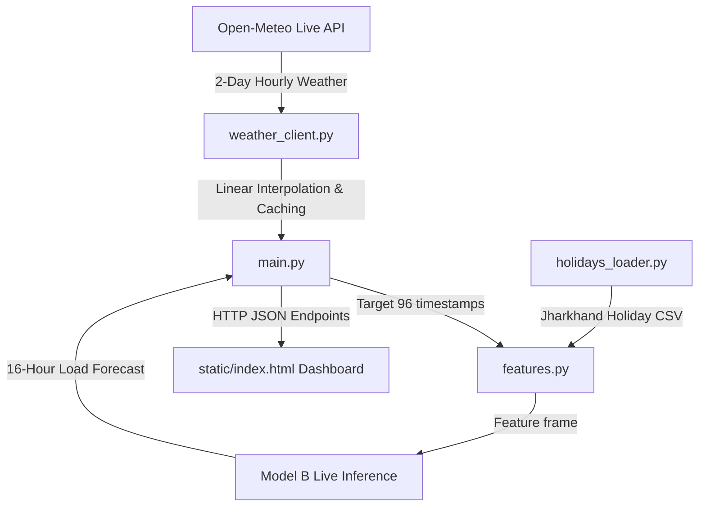

# Apex Power & Utilities (APU) — Demand Forecasting Live System

This project implements the production-ready live forecasting system for APU's grid load dispatching. The architecture connects a live weather forecast feed (Open-Meteo API) with a custom feature engineering pipeline. Predictions are served in real-time by a FastAPI backend utilizing Model B (weather + calendar features, trained on Dhanbad conditions), which are then rendered on a highly responsive, glassmorphic web dashboard that auto-refreshes every 10 minutes.

---
**Live demo:** https://apu-demand-forecast.onrender.com/
*(Render free tier — may take 30–60s to wake up if idle. Refresh once if the first load looks stale.)*


## Architecture Overview



1. **Live Weather Sourcing**: The backend requests 2 days of hourly weather forecast parameters (temperature, humidity, cloud cover, wind speed) from the Open-Meteo API for Dhanbad, Jharkhand.
2. **Feature Pipeline**: The weather data is resampled to 10-minute intervals via linear interpolation. Features are engineered on the fly to match the model training specification, including cyclical hour/day of week encodings, cooling degree days, and holiday distances.
3. **Model Inference**: Model B (`model_b_live.pkl`) predicts the electricity load in kW for the next 96 blocks (16 hours).
4. **Dashboard**: A single-page web app fetches the forecast, weather parameters, and holidays to present them visually with interactive line charts, sparklines, and holiday alerts.

---

Historical load + weather + holiday data → cleaned and feature-engineered in Jupyter →
gradient-boosted model trained offline → FastAPI backend that, on each request, pulls live Dhanbad
weather and checks the holiday calendar → serves a 24-hour forecast → dashboard auto-refreshes every
10 minutes.

```
data → notebooks (EDA, features, model) → backend/artifacts/*.pkl → FastAPI → dashboard
                                                                         ↑
                                                          live Open-Meteo weather (per request)
```

---

## Repo structure

```
.
├── data/
│   ├── Utility_consumption.csv          # raw, as provided
│   └── utility_consumption_clean.csv    # cleaned (Milestone 1 output)
├── notebooks/
│   ├── 01_eda_and_cleaning.ipynb        # Milestone 1 — EDA & cleaning
│   └── 02_features_and_model.ipynb      # Milestone 2 — features, model training, justification
├── backend/
│   ├── app/
│   │   ├── main.py                      # FastAPI app, endpoints
│   │   ├── weather_client.py            # live Open-Meteo integration
│   │   ├── features.py                  # feature engineering (mirrors notebook 02)
│   │   ├── holidays_loader.py
│   │   └── static/index.html            # frontend dashboard
│   ├── artifacts/                       # trained models + metadata (loaded at startup)
│   └── requirements.txt
├── Dockerfile
└── README.md
```

---

## Running it

**Docker (recommended):**
```bash
docker build -t apu-demand-forecast .
docker run -p 8000:8000 apu-demand-forecast
# open http://localhost:8000
```

**Local (no Docker):**
```bash
cd backend
pip install -r requirements.txt
uvicorn app.main:app --reload --port 8000
```

---

## API reference

| Endpoint | Description |
|---|---|
| `GET /forecast?mode=live` | Next 24h (96 × 10-min blocks) predicted load, using live weather + calendar features |
| `GET /forecast?mode=backtest` | Historical holdout predictions from Model A, for comparison |
| `GET /weather` | Live Dhanbad weather (temperature, humidity, cloud cover, wind speed) for the forecast window |
| `GET /holidays` | Gazetted + regional festival holidays overlapping the forecast window |
| `GET /health` | Liveness check |

---

## Methodology summary

| Step | Approach | Why |
|---|---|---|
| Date parsing | Detected and fixed two silently mixed datetime formats | Naive parsing dropped ~60% of rows as invalid |
| Outliers | IQR winsorizing (3× fence), feeder-specific | Outliers were a real short-lived demand event, not sensor noise — clipping preserves the time index for lag features |
| Weather | Open-Meteo Historical API (training) / Forecast API (live) | Free, no key, covers temperature/humidity/cloud cover/wind speed as required |
| Holidays | `holidays` library (Jharkhand) + manually curated regional tribal festivals | Generic national calendars miss Sarhul, Karma, Sohrai, Tusu Parab |
| Model | HistGradientBoostingRegressor, two variants | Matches the non-linear seasonality + weather interactions seen in EDA |

Full reasoning and charts are in the notebooks — this table is a summary, not a replacement for them.

### Model comparison (28-day holdout)

| Model | MAPE | Used for |
|---|---|---|
| Seasonal-naive baseline | 10.7% | Sanity check |
| Model A (weather + calendar + lags) | 0.65% | Offline backtesting only |
| Model B (weather + calendar, no lags) | 9.2% | **The live API** |

---

## Known limitations (stated honestly rather than hidden)

- **No live SCADA feed exists in this prototype.** Model A's near-perfect accuracy depends on recent
  true load values (`lag_1step`, etc.), which aren't available at live request time — so the live API
  uses Model B instead, which is honestly weaker but doesn't depend on data we don't have.
- **Sohrai's 2026 date is ambiguous between sources** (traditional post-Diwali rule vs. one third-party
  holiday listing) — both candidates are in `jharkhand_holidays.csv`, flagged `confidence: conflicting`.
  Worth a final check against the official Jharkhand gazette.
- **The historical weather archive fetch requires live internet access to run** — if re-executing the
  notebooks offline, a clearly-labeled synthetic fallback is used so the notebook still runs end-to-end,
  but real Dhanbad weather is used whenever internet is available.
- Regional festival dates are computed from documented lunar-calendar rules where an authoritative
  Gregorian date wasn't independently verifiable, and are marked accordingly by confidence level.

---

## Documented Limitations & Trade-offs

1. **Model A vs Model B Accuracy**:
   - **Model A** achieves a highly accurate **0.65% MAPE** during backtesting because it utilizes autoregressive lag features (e.g., load 10-minutes ago).
   - **Model B** (deployed for live mode) achieves a **9.2% MAPE**. This lower accuracy is a necessary trade-off because this prototype lacks a live SCADA telemetry feed to provide real-time loads. 
2. **Conflicting Sohrai Festival Sourcing**:
   - The gazetted date for the Sohrai festival in Jharkhand has conflicting sources for 2026. The government rule (day after Diwali) lands on **November 9, 2026**, whereas some third-party banking sites list **January 12-13, 2026**.
   - Currently, both dates have been populated in `jharkhand_holidays.csv` with `confidence: conflicting`. These dates should be verified against the official government gazette when the year's list is finalized.
3. **Holiday Maintenance**:
   - While national and state-level holidays are dynamically handled, regional tribal festival dates (e.g., Sarhul, Karam, Sohrai) follow complex lunar rules and must be manually extended in `jharkhand_holidays.csv` for years beyond 2026.
