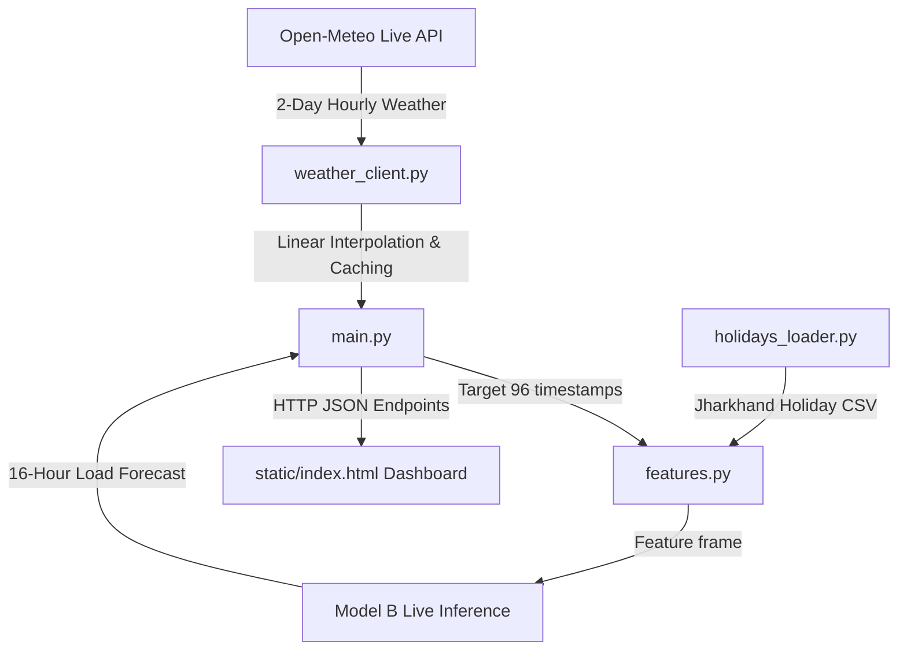

# Apex Power & Utilities (APU) — Demand Forecasting Live System

This project implements the production-ready live forecasting system for APU's grid load dispatching. The architecture connects a live weather forecast feed (Open-Meteo API) with a custom feature engineering pipeline. Predictions are served in real-time by a FastAPI backend utilizing Model B (weather + calendar features, trained on Dhanbad conditions), which are then rendered on a highly responsive, glassmorphic web dashboard that auto-refreshes every 10 minutes.

---
**Live demo:** https://apu-demand-forecast.onrender.com/
*(Render free tier — may take 30–60s to wake up if idle. Refresh once if the first load looks stale.)*


## Architecture Overview



1. **Live Weather Sourcing**: The backend requests 2 days of hourly weather forecast parameters (temperature, humidity, cloud cover, wind speed) from the Open-Meteo API for Dhanbad, Jharkhand.
2. **Feature Pipeline**: The weather data is resampled to 10-minute intervals via linear interpolation. Features are engineered on the fly to match the model training specification, including cyclical hour/day of week encodings, cooling degree days, and holiday distances.
3. **Model Inference**: Model B (`model_b_live.pkl`) predicts the electricity load in kW for the next 96 blocks (16 hours).
4. **Dashboard**: A single-page web app fetches the forecast, weather parameters, and holidays to present them visually with interactive line charts, sparklines, and holiday alerts.

---

## Getting Started

### Option 1: Docker Packaging (Recommended)

To run the complete system in a single container:

1. **Build the Docker image**:
   ```bash
   docker build -t apu-demand-forecast .
   ```

2. **Run the container**:
   ```bash
   docker run -d -p 8000:8000 --name apu-live apu-demand-forecast
   ```

3. **Access the dashboard**:
   Open your browser to `http://localhost:8000/`.

### Option 2: Local Development (No Docker)

Ensure you have Python 3.10+ installed.

1. **Navigate to the backend folder**:
   ```bash
   cd backend
   ```

2. **Install requirements**:
   ```bash
   pip install -r requirements.txt
   ```

3. **Start the Uvicorn development server**:
   ```bash
   python -m uvicorn app.main:app --host 0.0.0.0 --port 8000 --reload
   ```

4. **Access the dashboard**:
   Open your browser to `http://localhost:8000/`.

---

## API Reference

### 1. Health Check
* **Endpoint**: `GET /health`
* **Response**:
  ```json
  {
    "status": "ok"
  }
  ```

### 2. Live Weather Feed
* **Endpoint**: `GET /weather`
* **Description**: Returns 96 blocks of 10-minute resampled weather forecasts starting from "now".
* **Response**:
  ```json
  {
    "generated_at": "2026-06-18T15:00:00+05:30",
    "stale": false,
    "data": [
      {
        "timestamp": "2026-06-18T15:00:00+05:30",
        "temperature": 32.4,
        "humidity": 68.0,
        "cloud_cover": 40.0,
        "wind_speed": 12.5
      }
    ]
  }
  ```

### 3. Holidays Loader
* **Endpoint**: `GET /holidays`
* **Description**: Identifies holidays falling in the 16-hour forecast window and reports the next upcoming holiday.
* **Response**:
  ```json
  {
    "in_window": [
      {
        "date": "2026-06-18",
        "name": "Local Tribal Festival",
        "type": "regional_tribal",
        "confidence": "high"
      }
    ],
    "nearest_upcoming": {
      "date": "2026-08-15",
      "name": "Independence Day",
      "days_away": 58
    }
  }
  ```

### 4. Forecast Endpoint
* **Endpoint**: `GET /forecast?mode={live|backtest}`
* **Parameters**:
  - `mode` (optional, default: `live`):
    - `live`: Runs live inference using **Model B** (weather + calendar only).
    - `backtest`: Serves historical holdout predictions using **Model A** (includes lag features).
* **Response**:
  ```json
  {
    "generated_at": "2026-06-18T15:00:00+05:30",
    "model": "model_b_live",
    "stale": false,
    "data": [
      {
        "timestamp": "2026-06-18T15:00:00+05:30",
        "predicted_load_kw": 74530.2
      }
    ]
  }
  ```

---

## Documented Limitations & Trade-offs

1. **Model A vs Model B Accuracy**:
   - **Model A** achieves a highly accurate **0.65% MAPE** during backtesting because it utilizes autoregressive lag features (e.g., load 10-minutes ago).
   - **Model B** (deployed for live mode) achieves a **9.2% MAPE**. This lower accuracy is a necessary trade-off because this prototype lacks a live SCADA telemetry feed to provide real-time loads. 
2. **Conflicting Sohrai Festival Sourcing**:
   - The gazetted date for the Sohrai festival in Jharkhand has conflicting sources for 2026. The government rule (day after Diwali) lands on **November 9, 2026**, whereas some third-party banking sites list **January 12-13, 2026**.
   - Currently, both dates have been populated in `jharkhand_holidays.csv` with `confidence: conflicting`. These dates should be verified against the official government gazette when the year's list is finalized.
3. **Holiday Maintenance**:
   - While national and state-level holidays are dynamically handled, regional tribal festival dates (e.g., Sarhul, Karam, Sohrai) follow complex lunar rules and must be manually extended in `jharkhand_holidays.csv` for years beyond 2026.
